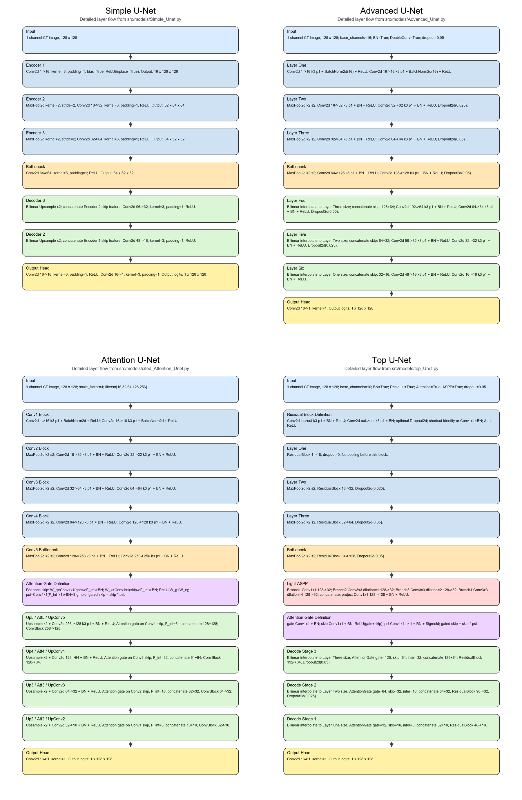
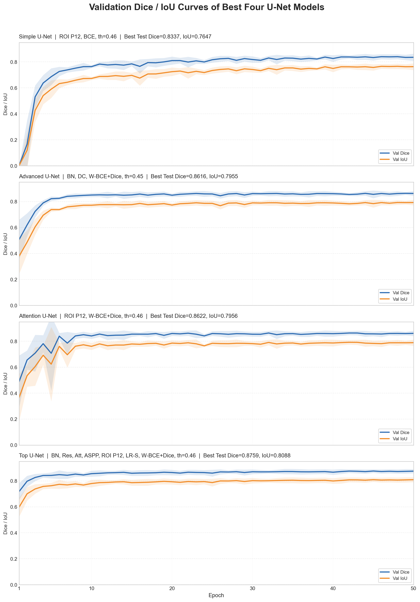
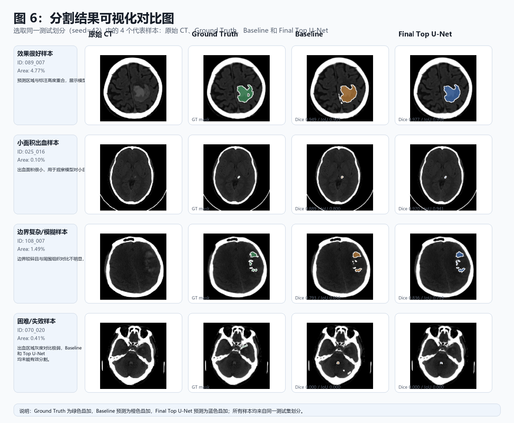

# 小样本条件下脑出血 CT 图像分割方法研究

本项目是一个面向脑出血 CT 图像的二值分割实验项目。研究目标是在样本数量有限、出血区域占比很小、边界模糊且模型容易过拟合的条件下，基于 U-Net 系列结构尽可能提升脑出血区域的自动分割精度与稳定性。

项目以课堂提供的 `Simple U-Net` 作为 baseline，在此基础上逐步引入 BatchNorm、Double Conv、Dropout、Residual Block、Attention Gate、Light ASPP、ROI 裁剪、Weighted BCE + Dice Loss 和学习率自适应调整器。所有实验结果都会保存为 JSON 文件，便于后续绘图、汇总和写入论文。

最终实验中，`Top U-Net + ROI + Weighted BCE + Dice Loss + LR Scheduler` 取得了当前最优结果：Test Dice 为 `0.8759±0.0088`，Test IoU 为 `0.8088±0.0111`。相比 `Simple U-Net` baseline，Dice 提升 `0.0468`，IoU 提升 `0.0495`，同时随机种子下的波动也明显减小。

## 目录

- [研究背景](#研究背景)
- [项目思路](#项目思路)
- [数据与实验设置](#数据与实验设置)
- [项目结构](#项目结构)
- [模型说明](#模型说明)
- [实验设计](#实验设计)
- [核心结果](#核心结果)
- [环境安装](#环境安装)
- [运行指令](#运行指令)
- [结果保存与可视化](#结果保存与可视化)
- [结论与后续方向](#结论与后续方向)

## 研究背景

脑出血是临床中较为危急的脑血管疾病之一，快速、准确地定位出血区域对于辅助诊断、血肿定量评估和治疗方案制定具有重要意义。传统人工阅片依赖医生经验，在急诊场景下耗时较长；而自动分割模型可以在像素级定位病灶区域，为后续面积或体积估计提供基础。

本实验面临的主要困难包括：

- 脑出血区域通常只占整张 CT 图像的一小部分，前景和背景极度不平衡。
- 出血边界可能模糊，部分样本灰度差异不明显。
- 小样本医学图像标注成本高，模型容易过拟合。
- 普通 U-Net 对小病灶、复杂形态和噪声背景的处理能力仍有提升空间。

因此，本项目重点关注如何通过合理的网络结构、损失函数、ROI 裁剪和训练策略，在小样本条件下提高脑出血 CT 图像分割的 Dice 和 IoU。

## 项目思路

整个实验遵循“从简单模型到复杂模型、从单模块验证到组合改进”的路线：

1. 使用 `Simple U-Net` 作为基础 baseline，获得最低限度的参考性能。
2. 构建 `Advanced U-Net`，通过 argparse 控制 BatchNorm、Double Conv 和 Dropout，用于结构消融。
3. 引入 `Attention U-Net`，验证 Attention Gate 对 skip connection 中背景噪声的过滤作用。
4. 设计 `Top U-Net`，同时结合 Residual Block、Attention Gate 和 Light ASPP，增强特征提取与多尺度上下文建模。
5. 使用基于原始 CT 灰度的 ROI 裁剪，提高脑区和出血区域在输入图像中的相对占比。
6. 比较 BCE、Focal Loss、Tversky Loss、Weighted BCE + Dice Loss，选择更适合小目标分割的损失函数。
7. 使用多个随机种子重复关键实验，降低偶然性对最终结论的影响。

整体数据流如下：

```text
CT image + binary mask
        |
        v
数据读取与配对
        |
        v
训练集 / 验证集 / 测试集划分
        |
        v
可选 ROI 裁剪与数据增强
        |
        v
模型训练与验证
        |
        v
保存 best_model.pth
        |
        v
测试集评估 Dice / IoU
        |
        v
保存 configs JSON 与预测图像
```

## 数据与实验设置

| 项目 | 设置 |
| --- | --- |
| 数据集 | `brain_images` |
| 图像类型 | 脑出血 CT 图像 |
| 标注形式 | 二值 mask |
| 数据量 | 1050 张 |
| 数据划分 | 训练集:验证集:测试集 = 7:2:1 |
| 输入尺寸 | `128 x 128` |
| Batch size | `8` |
| Epochs | `50` |
| Optimizer | Adam |
| 主要指标 | Dice、IoU |
| 关键随机种子 | `42, 1997, 2006, 2025, 2026` |
| 最佳阈值 | `0.46` |
| 最佳 ROI 设置 | `roi_threshold=5, roi_padding=12` |

本项目中的 ROI 裁剪只使用原始 CT 图像的灰度信息寻找脑区范围，然后同步裁剪 image 和 mask，不使用 mask 信息计算 ROI，因此不会造成标签泄露。

## 项目结构

```text
.
├── main.py                         # 统一入口：train_test / test / visualize
├── requirements.txt                # Python 依赖
├── README.md
├── brain_images/                   # CT 图像与对应 mask
├── configs/                        # 每次实验的参数、训练记录和测试结果
├── outputs/                        # 模型权重、预测结果、可视化图像
└── src/
    ├── args_parse.py               # argparse 参数定义
    ├── data_process.py             # 数据读取、划分、DataLoader
    ├── data_augment.py             # 数据增强
    ├── data_roi.py                 # ROI 裁剪
    ├── result_store.py             # 实验结果保存
    ├── train_test.py               # 训练、验证、测试主流程
    ├── criterion/
    │   ├── Focal_Loss.py
    │   ├── Tversky_Loss.py
    │   └── Weighted_DiceLoss.py
    ├── models/
    │   ├── Simple_Unet.py
    │   ├── Advanced_Unet.py
    │   ├── cited_Attention_Unet.py
    │   └── top_Unet.py
    └── utils/
        ├── mertics.py              # Dice、IoU 计算
        └── visualize.py            # 实验结果绘图
```

## 模型说明

| 模型参数名 | 模型名称 | 主要用途 |
| --- | --- | --- |
| `baseline` | Simple U-Net | 课堂基础模型，用作性能基准。 |
| `Advanced_Unet` | Advanced U-Net | 在基础 U-Net 上加入 BatchNorm、Double Conv、Dropout，便于做消融实验。 |
| `cited_Unet` | Attention U-Net | 引入 Attention Gate，用于验证注意力机制对 skip connection 的作用。 |
| `top_Unet` | Top U-Net | 融合 Residual Block、Attention Gate 和 Light ASPP，是本项目的最终改进模型。 |

### Simple U-Net

`Simple U-Net` 保留经典 U-Net 的编码器-解码器结构。编码器通过下采样提取深层语义特征，解码器通过上采样恢复空间分辨率，并利用 skip connection 融合浅层细节特征。它的作用是提供一个清晰、可解释的 baseline。

### Advanced U-Net

`Advanced U-Net` 不改变基础 U-Net 的整体骨架，而是将 BatchNorm、Double Conv 和 Dropout 设计为可选模块。这样可以在同一个模型文件中通过命令行参数控制结构变化，更方便比较不同模块对实验结果的影响。

### Attention U-Net

`Attention U-Net` 在 skip connection 融合前加入 Attention Gate。它通过深层特征生成注意力权重，对编码器传来的浅层特征进行筛选，从而减少无关背景区域对解码器的干扰。

### Top U-Net

`Top U-Net` 是本项目最终使用的综合改进模型。它保留 U-Net 的定位能力，同时加入三类关键模块：

- `Residual Block`：增强特征提取能力，缓解深层网络训练不稳定的问题。
- `Attention Gate`：过滤 skip connection 中的背景噪声，让模型更关注出血区域。
- `Light ASPP`：在 bottleneck 处扩大多尺度感受野，增强对不同大小病灶的建模能力。

## 实验设计

本项目的实验不是一次性比较所有模型，而是分阶段验证：

| 阶段 | 目的 | 说明 |
| --- | --- | --- |
| Baseline 实验 | 建立基础参考线 | 训练 Simple U-Net，得到最基础的 Dice 和 IoU。 |
| Advanced U-Net 消融 | 判断基础模块是否有效 | 比较 BatchNorm、Double Conv、Dropout 的影响。 |
| 损失函数对比 | 解决类别不平衡问题 | 比较 BCE、Focal、Tversky、Weighted BCE + Dice。 |
| ROI 裁剪实验 | 减少背景干扰 | 比较使用 ROI 前后的模型性能。 |
| Top U-Net 消融 | 验证最终模型模块 | 分析 Residual、Attention、ASPP、LR Scheduler 的贡献。 |
| 最终模型对比 | 得到论文主结果 | 比较 Simple、Advanced、Attention、Top U-Net。 |

关键实验采用 5 个随机种子重复运行，并报告均值和标准差。部分早期探索实验主要用于判断方向，不作为最终结论的唯一依据。

## 核心结果

### 主要模型对比

| 模型 | 主要配置 | Test Dice | Test IoU |
| --- | --- | ---: | ---: |
| Simple U-Net | BCE, no ROI, th=0.45 | `0.8291±0.0230` | `0.7593±0.0240` |
| Simple U-Net | BCE, ROI(T=5,P=12), th=0.46 | `0.8337±0.0240` | `0.7647±0.0247` |
| Advanced U-Net | BN + DC + Dropout0.05, Weighted BCE + Dice | `0.8616±0.0190` | `0.7955±0.0171` |
| Attention U-Net | Weighted BCE + Dice, ROI(T=5,P=12), th=0.46 | `0.8622±0.0212` | `0.7956±0.0214` |
| Top U-Net | BN + Res + Att + ASPP, no ROI, th=0.46 | `0.8633±0.0186` | `0.7966±0.0198` |
| Top U-Net | BN + Res + Att + ASPP + ROI + LR Scheduler, th=0.46 | `0.8759±0.0088` | `0.8088±0.0111` |

### Top U-Net 模块消融

| 模型配置 | Test Dice | Test IoU |
| --- | ---: | ---: |
| BN + ROI | `0.8585±0.0180` | `0.7918±0.0201` |
| BN + Res + ROI | `0.8638±0.0177` | `0.7981±0.0168` |
| BN + Res + Att + ROI | `0.8551±0.0230` | `0.7884±0.0249` |
| BN + Res + ASPP + ROI | `0.8568±0.0261` | `0.7904±0.0275` |
| BN + Res + Att + ASPP + ROI | `0.8713±0.0115` | `0.8025±0.0165` |
| BN + Res + Att + ASPP + ROI + LR Scheduler | `0.8759±0.0088` | `0.8088±0.0111` |

### 结果解读

从实验结果可以看出，基础 U-Net 已经能够完成脑出血区域的大致定位，但对于小面积出血和边界模糊样本仍存在漏分割或边界不连续问题。ROI 裁剪能够减少无关黑色背景，使病灶区域在输入图像中的相对占比提高，因此对 baseline 和最终模型都有帮助。

在损失函数方面，Weighted BCE + Dice Loss 表现更适合当前任务。Weighted BCE 缓解前景和背景像素数量不平衡的问题，Dice Loss 则直接约束预测区域和真实 mask 的重叠程度，两者结合更适合脑出血这种小目标分割任务。

在模型结构方面，单个模块的提升并不总是稳定，但 Residual、Attention、ASPP 与 ROI、学习率调度器组合后效果最好。这说明在小样本场景下，模型性能提升更依赖“结构、损失函数、预处理和训练策略”的配合，而不是单纯堆叠更复杂的网络。

## 可视化结果

项目中已生成部分论文可用图像：







如果图片未显示，可以直接在本地打开对应路径：

- `outputs/model_figures/`
- `outputs/visual_examples/`
- `outputs/visualizations/`

## 环境安装

建议使用 Python 3.10 或以上版本，并根据本机 CUDA 版本安装合适的 PyTorch。

```bash
pip install -r requirements.txt
```

`requirements.txt` 中包含本项目使用的主要依赖：

```text
torch
tqdm
numpy
argparse
matplotlib
albumentations
```

## 运行指令

项目统一从 `main.py` 运行。常用模式包括：

| 模式 | 含义 |
| --- | --- |
| `--mode train_test` | 训练、验证并在测试集评估。 |
| `--mode test` | 读取已有 `best_model.pth`，只进行测试。 |
| `--mode visualize` | 根据 `configs/` 中的 JSON 结果绘图。 |

### 训练 baseline

```bash
python main.py --mode train_test --model baseline --criterion BCEWithLogitLoss --epochs 50 --batch_size 8 --image_size 128 --threshold 0.45 --seed 42 --save_dir outputs/baseline_seed42
```

### 训练 Advanced U-Net

```bash
python main.py --mode train_test --model Advanced_Unet --criterion Weighted_BCE+DiceLoss --epochs 50 --batch_size 8 --image_size 128 --BatchNorm --Double_Conv --dropout 0.05 --threshold 0.45 --seed 42 --save_dir outputs/advanced_weighted_seed42
```

### 训练 Attention U-Net

```bash
python main.py --mode train_test --model cited_Unet --criterion Weighted_BCE+DiceLoss --epochs 50 --batch_size 8 --image_size 128 --roi_crop --roi_threshold 5 --roi_padding 12 --threshold 0.46 --seed 42 --save_dir outputs/attention_roi_seed42
```

### 训练最终 Top U-Net

```bash
python main.py --mode train_test --model top_Unet --criterion Weighted_BCE+DiceLoss --epochs 50 --batch_size 8 --image_size 128 --BatchNorm --Residual --Attention --ASPP --dropout 0.05 --roi_crop --roi_threshold 5 --roi_padding 12 --threshold 0.46 --lr_scheduler --seed 42 --save_dir outputs/top_roi_scheduler_seed42
```

### 只测试已有模型

测试时需要保证模型参数与训练时一致，并让 `--save_dir` 指向包含 `best_model.pth` 的目录。

```bash
python main.py --mode test --model top_Unet --criterion Weighted_BCE+DiceLoss --image_size 128 --BatchNorm --Residual --Attention --ASPP --dropout 0.05 --roi_crop --roi_threshold 5 --roi_padding 12 --threshold 0.46 --save_dir outputs/top_roi_scheduler_seed42
```

### 多随机种子实验

论文中的关键结果建议使用 5 个随机种子重复运行。下面以最终 Top U-Net 为例：

```powershell
$seeds = @(42, 1997, 2006, 2025, 2026)
foreach ($seed in $seeds) {
    python main.py --mode train_test --model top_Unet --criterion Weighted_BCE+DiceLoss --epochs 50 --batch_size 8 --image_size 128 --BatchNorm --Residual --Attention --ASPP --dropout 0.05 --roi_crop --roi_threshold 5 --roi_padding 12 --threshold 0.46 --lr_scheduler --seed $seed --save_dir outputs/top_roi_scheduler_seed$seed
}
```

## 结果保存与可视化

每次实验结束后，项目会自动保存两类结果：

- `<save_dir>/best_model.pth`：验证集 Dice 最优的模型权重。
- `configs/<experiment_name>/<timestamp>.json`：实验参数、模型参数量、训练过程、测试集 Dice 和 IoU。

JSON 文件中的主要字段包括：

```text
experiment_name      # 实验名称
created_at           # 保存时间
parameters           # 本次运行的命令行参数
model_parameters     # 模型总参数量与可训练参数量
results.train        # 训练历史与最佳验证结果
results.test         # 测试集 Dice、IoU、预测图像目录
```

### 绘制单个实验目录

```bash
python main.py --mode visualize --config_dir configs/<experiment_name> --out_dir outputs/visualizations
```

### 对比两个实验目录

```bash
python -m src.utils.visualize --mode compare_dirs --dir_a configs/<experiment_a> --dir_b configs/<experiment_b> --out_dir outputs/visualizations
```

## 注意事项

- 当前最终模型没有使用数据增强，因为在本数据集和当前增强幅度下，增强后的结果略低于不增强结果。
- `threshold` 会影响最终 Dice 和 IoU，本项目当前实验中 `0.46` 是最终 Top U-Net 的较优阈值。
- ROI 裁剪的 padding 会影响保留上下文的多少，当前主实验使用 `roi_padding=12`。
- 训练时建议固定 `seed`，关键实验建议使用多个 seed 报告均值和标准差。
- 若只运行测试，必须保证 `--save_dir` 下存在训练好的 `best_model.pth`。

## 结论与后续方向

本项目说明，在小样本脑出血 CT 图像分割任务中，合理的组合式改进比单独增加模型复杂度更有效。ROI 裁剪减少了背景干扰，Weighted BCE + Dice Loss 缓解了类别不平衡，Residual Block 增强了特征提取能力，Attention Gate 改善了 skip connection 的信息筛选，Light ASPP 提供了多尺度上下文建模，学习率调度器则提升了训练后期的收敛稳定性。

当前方法仍然存在不足。对于极小面积出血、灰度差异不明显或边界复杂的样本，模型仍可能出现漏分割或误分割。后续可以尝试以下方向：

- 引入 2.5D 或 3D U-Net，利用相邻 CT 切片的空间信息。
- 尝试 TransUNet、Swin-Unet 等 CNN 与 Transformer 结合的模型。
- 增加边界约束损失或后处理方法，改善边界模糊样本。
- 在更多数据集、不同设备或不同医院来源的数据上验证泛化能力。
- 增加 Sensitivity、Specificity、Hausdorff Distance 等指标，使评价更加全面。

总体而言，本项目完成了从 baseline 构建、模型改进、损失函数比较、ROI 预处理、消融实验到可视化分析的完整流程，可作为小样本医学图像分割任务的一个可复现实验范例。
